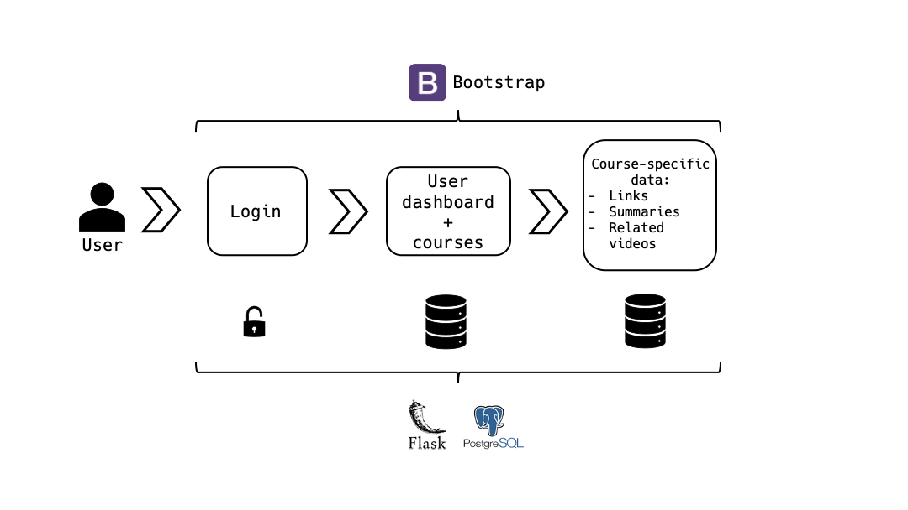

<div align="center">


</div>

# Tutor - Sharing Towards Excellence 👨🏻‍🏫

Tutor is an open-source application for students, made by students.
Using Tutor, you can share helpful information you have stumbled upon online, summaries you wrote, and have all the information you need for every course at the tip of your fingertips.

Sign up to the subjects your'e enrolled in and see what helped other students understand the material better and get great grades in the course. 

If your school uses Moodle, Tutor can automatically check for updated HW grades and display your grades in one simple-to-use dashboard, so you know where your'e standing.

# App Components

<div align="center">



</div>

## Functionality

### 1. User management - login screen
### 2. Main page - Dashboard
The dashboard shows the student's current grades and all courses [s]he is enrolled in. 
### 3. Course page
From the main page, the user can choose a specific course to look at and see all data relevant to this specific course. 
The user has the ability to sign up to courses, create courses, and to add/remove data from course.

## Backend

Implemented with Flask and PostreSQL using the following components:

1. Table for all courses available in the app
2. Table for each course, filled with the data relevant for that specific app.
3. User has the ability to add and remove courses, as well as add and remove data from each course's table.

## Frontend

Implemented with bootstrap.

## Login System

TBD

## Testing and CI

1. github actions
2. pytest

## Issues and Dillemas

1. Can we implement feature that gets grades from Moodle (Privacy issue)? If not, can add feature that user's add their grades manually.

# Getting Started

These instructions will get you a copy of the project up and running on your local machine.

### Prerequisites

What things you need to install the software and how to install them:

- Download and Install [Vagrant](https://www.vagrantup.com/) and [Virtual Box](https://www.virtualbox.org/) on your local computer
- Clone/ Download the zip file from the Groot repository to your local computer

### Initializing Project Tutor Virtual Environment

A step by step series that tell you how to get Project Tutor up and running

1. Clone + Fork the repository
2. Open command prompt and navigate to the local directory where all the files are
3. Spin the environment using:

```
   vagrant up
```

4. open your browser and nevigate to http://0.0.0.0:5000/

5. When finished, tear down the environment using:

```
CTRL + C
vagrant destroy -f
```

# Dependencies

We will supply a requirement.txt and a bootstrap file that will install all the needed libraries in the future.

These are the current libraries used:

Python 3.7

Flask 1.1.2 

PostgreSQL 10.14

# Our Team:

##### Golan Cohen
##### Michal Shamir
##### Moshe Nagar
##### Lior Reytan
##### Yuval Margules
